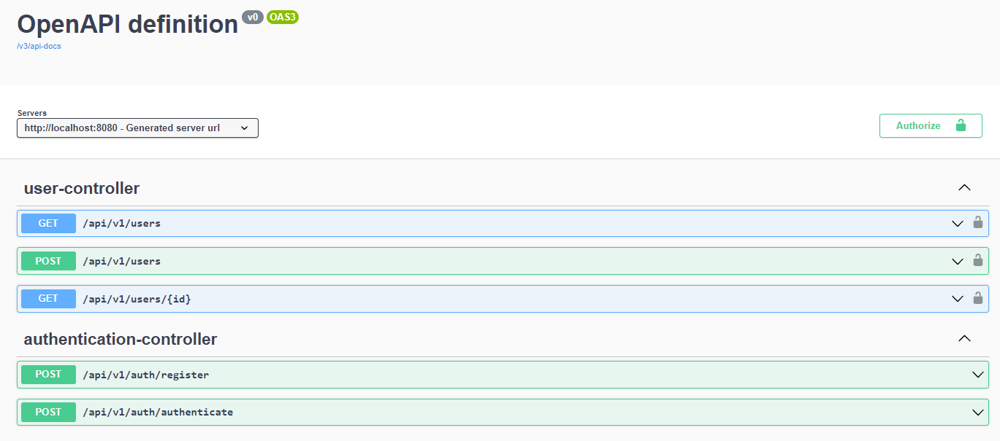

# AuthService 

## How to start project (Temporarily)

*To start the project you need JDK 19 and the downloaded Docker with the redis container*

1. Go to the root folder of the project and on the command line write the command:
    ```docker-compose up --build -d```

2. Then run the program in a way that is convenient for you. For example, through the IDE.
   To do this, you need to run the main program class: ```AuthServiceApplication.class```

3. Go to the browser and go to: ```http://localhost:8080/swagger-ui.html```
4. Done, you can test the application.

### `You are great!`

## About project

This project is a microservice for authorizing a user and issuing him a token.
Also, this service allows you to perform CRUD operations on users from the database.
This application contains both protected requests (for user browsing and unprotected 
requests).

The application has swagger documentation. A screenshot of it is shown on the screen below.



## Technology stack
- Spring Boot 3
- Spring Security
- JWT token
- Redis
- Docker compose
- Swagger-ui